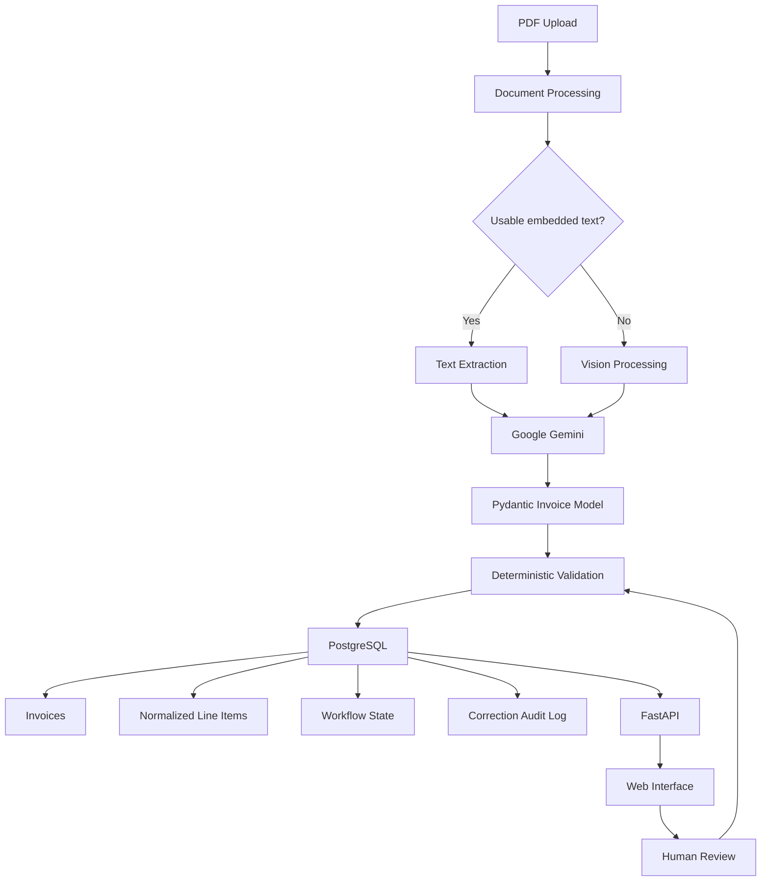

# Invoice Intelligence

A production-oriented AI application for extracting, validating, reviewing and managing structured invoice data from PDF documents.

The project combines LLM-based document understanding with deterministic validation, PostgreSQL persistence, a human review workflow, audit logging, automated testing, CI/CD and a web interface.

## Overview

Invoice Intelligence processes an uploaded invoice through a complete document-processing workflow:

```text
PDF invoice
    ↓
Document processing
    ├── embedded text extraction
    └── vision fallback for image-based PDFs
    ↓
Google Gemini
    ↓
Structured Pydantic Invoice
    ↓
Deterministic business validation
    ↓
PostgreSQL
    ├── invoice snapshot
    ├── normalized line items
    ├── workflow state
    ├── duplicate detection
    └── correction audit history
    ↓
FastAPI
    ↓
Web interface
    ↓
Human review / correction
    ↓
Revalidation and approval workflow
```

The goal is not just to demonstrate an LLM call, but to show how AI extraction can be integrated into a more complete and reliable software system.

---

## Features

### AI document extraction

- PDF processing using PyMuPDF
- automatic text extraction for digital PDFs
- vision fallback for scanned or image-based PDFs
- structured extraction using Google Gemini
- Pydantic-based structured output
- supplier and customer extraction
- invoice dates and invoice numbers
- totals and VAT information
- individual invoice line items
- VAT breakdown extraction

### Deterministic validation

LLM output is validated using normal Python business rules.

Examples include:

```text
subtotal + VAT ≈ total amount

sum(line item totals) ≈ subtotal

due date >= invoice date

VAT breakdown totals must match invoice VAT

VAT calculations must be internally consistent
```

This separates two responsibilities:

```text
LLM
→ extract information from the document

Python
→ verify whether the extracted information is logically consistent
```

### PostgreSQL persistence

Processed invoices are stored in PostgreSQL.

The application keeps both:

```text
invoice_data JSON
→ complete structured extraction snapshot

relational tables
→ queryable operational data
```

Invoice line items are normalized into a separate `invoice_line_items` table.

This makes queries and future analytics much easier than storing everything only as JSON.

### Duplicate detection

Invoices are checked for possible duplicates using invoice number and supplier information.

Duplicates are still stored, but reference the original invoice using `duplicate_of_id`.

This allows the application to surface duplicates without silently discarding uploaded documents.

### Invoice workflow

Invoices use a simple accounts-payable workflow:

```text
new
 ↓
approved
 ↓
paid
```

Controlled reverse transitions are also supported:

```text
approved → new
paid → approved
```

Workflow timestamps record when an invoice was approved or paid.

### Human-in-the-loop review

Extracted invoices can be manually corrected from the web interface.

Editable information includes:

- invoice number
- invoice and due dates
- supplier information
- customer information
- currency
- subtotal
- VAT
- total amount
- invoice line items

After a correction:

```text
manual edit
    ↓
structured invoice updated
    ↓
business validation reruns
    ↓
normalized line items are synchronized
    ↓
audit history is written
```

If an already approved or paid invoice is changed, it automatically returns to `new` so that the corrected invoice must be reviewed again.

### Correction audit trail

Manual changes are stored in `invoice_corrections`.

Each audit entry records:

```text
field name
old value
new value
changed by
source
timestamp
```

Example:

```text
supplier_name

NorthStar Software B.V.
→
NorthStar Software Groningen B.V.

source: human
```

Automatic workflow changes caused by corrections are also recorded with `source: system`.

### Web interface

The application includes a lightweight frontend served directly by FastAPI.

Available pages include:

```text
/
→ dashboard and invoice upload

/invoices
→ invoice overview, filters and search

/invoices/{id}
→ invoice details, line items, validation,
   workflow actions and correction history

/analytics
→ financial and workflow analytics

/docs
→ interactive FastAPI / Swagger API documentation
```

The invoice overview supports live search by supplier or invoice number.

Filters are available for:

```text
All
New
Approved
Paid
Overdue
Duplicates
```

### Analytics

The application includes analytics over stored invoices, including:

- total invoice count
- workflow status counts
- overdue invoices
- duplicate invoices
- invoices requiring attention
- invoices waiting for approval
- open amounts by currency
- paid amounts
- monthly payments
- supplier spend
- average approval time
- average payment time

Duplicate invoices are excluded from monetary aggregates to avoid double counting.

---

## Architecture



The LLM handles unstructured document interpretation.

Pydantic provides the structured contract.

Normal Python code handles validation and workflow rules.

PostgreSQL provides persistent and queryable operational data.

---

## Extracted invoice schema

The extraction model includes information such as:

```json
{
  "invoice_number": "INV-2026-0042",
  "invoice_date": "2026-09-15",
  "due_date": "2026-10-15",
  "supplier": {
    "name": "NorthStar Software B.V.",
    "address": "Zernikepark 12, 9747 AN Groningen",
    "vat_number": "NL865432109B01"
  },
  "customer": {
    "name": "Data Example B.V.",
    "address": "Helperpark 100, 9723 ZA Groningen",
    "vat_number": "NL123456789B01"
  },
  "currency": "EUR",
  "subtotal": "1990.00",
  "vat_amount": "417.90",
  "total_amount": "2407.90",
  "line_items": [
    {
      "description": "AI consultancy - architecture workshop",
      "quantity": "2",
      "unit_price": "450.00",
      "vat_rate": "21",
      "total": "900.00"
    }
  ]
}
```

Monetary values are represented using `Decimal` in Python.

---

## Structured output

Instead of asking the model to return arbitrary JSON, the application defines the expected structure using Pydantic models.

```text
Pydantic models
      ↓
JSON schema
      ↓
Gemini structured extraction
      ↓
Validated Python object
```

This creates a clear contract between the LLM and the rest of the application.

Unexpected output formats can therefore be caught before they enter the rest of the processing pipeline.

---

## Database design

The main persistent entities are:

```text
invoices
    │
    ├── invoice_line_items
    │
    └── invoice_corrections
```

### `invoices`

Stores operational invoice information and the complete JSON extraction snapshot.

Important fields include:

```text
invoice_number
supplier_name
customer_name
invoice_date
due_date
currency
subtotal
vat_amount
total_amount
valid
warnings
invoice_data
status
duplicate_of_id
approved_at
paid_at
```

### `invoice_line_items`

Stores normalized invoice lines:

```text
invoice_id
description
quantity
unit_price
vat_rate
total
```

### `invoice_corrections`

Stores the human-review audit trail:

```text
invoice_id
field_name
old_value
new_value
changed_by
source
changed_at
```

Database schema changes are managed using Alembic migrations.

---

## API

FastAPI automatically exposes interactive documentation at:

```text
http://127.0.0.1:8000/docs
```

Main endpoints include:

```text
GET    /api/health

POST   /api/invoices/extract

GET    /api/invoices
GET    /api/invoices/{invoice_id}

PATCH  /api/invoices/{invoice_id}
PATCH  /api/invoices/{invoice_id}/status

GET    /api/invoices/{invoice_id}/line-items
GET    /api/invoices/{invoice_id}/corrections

GET    /api/line-items/counts

GET    /api/analytics/summary
```

### Extract an invoice

```http
POST /api/invoices/extract
```

The endpoint accepts a PDF through `multipart/form-data`.

The processing pipeline returns information such as:

```json
{
  "filename": "test_invoice.pdf",
  "extraction_method": "text",
  "valid": true,
  "warnings": [],
  "database_id": 1,
  "duplicate": false,
  "duplicate_of_id": null
}
```

### Correct an invoice

```http
PATCH /api/invoices/{invoice_id}
```

Example:

```json
{
  "changed_by": "manual-review",
  "supplier_name": "Corrected Supplier B.V."
}
```

The invoice is updated, revalidated and the change is written to the correction history.

---

## Mock LLM mode

Automated tests should not depend on:

- external API availability
- network latency
- rate limits
- Gemini usage limits

The application therefore includes a deterministic mock extractor.

Enable mock mode:

```env
USE_MOCK_LLM=true
```

Use the real Gemini extractor:

```env
USE_MOCK_LLM=false
```

This keeps the regular test suite deterministic and free to run.

---

## Installation

The project uses Python 3.11.

Clone the repository:

```bash
git clone https://github.com/zwjulian/invoice-intelligence.git
cd invoice-intelligence
```

Create a virtual environment:

```bash
python -m venv .venv
```

Activate it in Windows PowerShell:

```powershell
Set-ExecutionPolicy -Scope Process -ExecutionPolicy Bypass
.\.venv\Scripts\Activate.ps1
```

Install dependencies:

```powershell
pip install -r requirements.txt
```

---

## Environment configuration

Create a `.env` file based on `.env.example`.

Example:

```env
GEMINI_API_KEY=your_api_key_here
GEMINI_MODEL=gemini-3.5-flash-lite
USE_MOCK_LLM=false
DATABASE_URL=your_database_url_here
```

The real `.env` file is ignored by Git and must not be committed.

---

## Database migrations

The project uses Alembic for database schema migrations.

Check the current migration:

```powershell
alembic current
```

Apply all migrations:

```powershell
alembic upgrade head
```

This allows database changes to be version-controlled together with application code.

---

## Running locally

Start the application:

```powershell
uvicorn app.main:app --reload
```

Then open:

```text
Web interface:
http://127.0.0.1:8000

Invoices:
http://127.0.0.1:8000/invoices

Analytics:
http://127.0.0.1:8000/analytics

Swagger:
http://127.0.0.1:8000/docs
```

---

## Automated tests

The project uses `pytest`.

Run:

```powershell
pytest -v
```

Current test suite:

```text
21 tests passing
```

The tests cover areas including:

- API health checks
- PDF invoice extraction
- rejection of invalid file formats
- digital PDF processing
- vision fallback
- empty and invalid PDFs
- invoice total validation
- subtotal validation
- due-date validation
- rounding tolerance
- line-item validation
- mixed VAT invoices
- VAT breakdown validation
- VAT calculations
- human invoice corrections
- audit history
- normalized line-item updates
- workflow reset after correcting an approved invoice

The test environment uses a dedicated temporary SQLite database.

This prevents local tests and CI from modifying the real PostgreSQL database.

---

## Code quality

Ruff is used for static checks and formatting rules.

Run the same check used by CI:

```powershell
ruff check app tests evaluation scripts alembic
```

The project is kept lint-clean before changes are merged.

---

## Continuous integration

GitHub Actions runs automatically after pushes and pull requests.

The CI workflow checks the application using a clean environment.

```text
Checkout repository
      ↓
Install Python
      ↓
Install dependencies
      ↓
Ruff checks
      ↓
pytest
      ↓
Docker build
```

This helps ensure that the codebase remains reproducible outside the local development machine.

---

## Docker

Build:

```powershell
docker build -t invoice-intelligence .
```

Run:

```powershell
docker run --env-file .env -p 8000:8000 invoice-intelligence
```

Open:

```text
http://127.0.0.1:8000
```

The same FastAPI application and web interface now run inside the container.

---

## Deployment

The application is deployed using Render.

The deployment uses the same application that is tested locally and through GitHub Actions.

Production persistence uses PostgreSQL.

The intended workflow is:

```text
local development
      ↓
pytest + Ruff
      ↓
Git commit
      ↓
GitHub Actions
      ↓
Render deployment
      ↓
PostgreSQL
```

---

## LLM evaluation

The Gemini extraction pipeline is evaluated separately from deterministic unit and API tests.

The repository contains a synthetic golden dataset where each generated invoice has corresponding known ground-truth values.

The evaluation pipeline is:

```text
Known invoice PDF
      ↓
Document processing
      ↓
Real Gemini extraction
      ↓
Predicted structured invoice
      ↓
Compare with ground truth
      ↓
Field-level evaluation
```

Run the benchmark with:

```powershell
python -m evaluation.evaluate
```

Detailed output is stored in:

```text
evaluation/results.json
```

The evaluation dataset is intentionally small and synthetic.

Results should therefore be interpreted as a regression and sanity-check benchmark, not as a claim of equivalent accuracy on arbitrary real-world invoices.

---

## Project structure

```text
invoice-intelligence/
│
├── app/
│   ├── core/
│   ├── models/
│   ├── services/
│   ├── static/
│   ├── database.py
│   ├── db_models.py
│   └── main.py
│
├── alembic/
│   └── versions/
│
├── evaluation/
│   ├── ground_truth/
│   ├── invoices/
│   ├── evaluate.py
│   └── results.json
│
├── scripts/
│
├── sample_data/
│
├── tests/
│
├── .github/
│   └── workflows/
│
├── Dockerfile
├── alembic.ini
├── requirements.txt
├── run_extraction.py
└── README.md
```

---

## Reliability choices

Several design decisions intentionally separate AI behaviour from deterministic application logic.

### LLM for interpretation

Gemini handles tasks that require understanding unstructured invoice documents.

### Pydantic for contracts

Pydantic ensures extracted data follows an expected structure.

### Python for business rules

Financial consistency is checked using deterministic code rather than asking the LLM whether its own answer is correct.

### PostgreSQL for operational data

Persistent invoice information, normalized line items and audit history are stored in relational tables.

### Human review for corrections

Users can correct extraction errors without losing the original processing history.

### Mock extraction for CI

Automated tests do not require live Gemini calls.

This keeps the core application testable even when external AI services are unavailable.

---

## Current limitations

The system is still a portfolio / demonstration project rather than a complete accounting platform.

Important limitations include:

- the evaluation dataset is small and synthetic
- invoice layout diversity is limited
- there is currently no user authentication or authorization
- background job processing is not implemented
- extraction confidence is not yet exposed per field
- real-world invoice accuracy has not been established on a large independent benchmark
- external Gemini availability and rate limits can still affect live extraction

---

## Possible future improvements

Potential extensions include:

```text
Field-level extraction confidence
Batch invoice processing
Authentication and user roles
Background processing / queues
Prompt versioning
Model comparison
LLM observability and tracing
Latency and cost monitoring
Larger real-world evaluation datasets
Line-item-level evaluation metrics
Semantic search across stored documents
```

Structured financial questions remain better suited to SQL, while semantic questions across documents could later use retrieval or vector search.

---

## Main technologies

```text
Python 3.11
FastAPI
Pydantic
SQLAlchemy
PostgreSQL
Alembic
Google Gemini
PyMuPDF
HTML / CSS / JavaScript
pytest
Ruff
Docker
GitHub Actions
Render
```

---

## Project goal

The project demonstrates how an LLM can be embedded in a larger production-oriented workflow:

```text
unstructured document
        ↓
AI extraction
        ↓
typed structured data
        ↓
deterministic validation
        ↓
persistent relational storage
        ↓
human review
        ↓
audit trail
        ↓
workflow management
        ↓
analytics
        ↓
testing and CI
        ↓
deployment
```

The focus is therefore not only on AI extraction, but on the software-engineering components needed to make AI output usable, reviewable and maintainable.